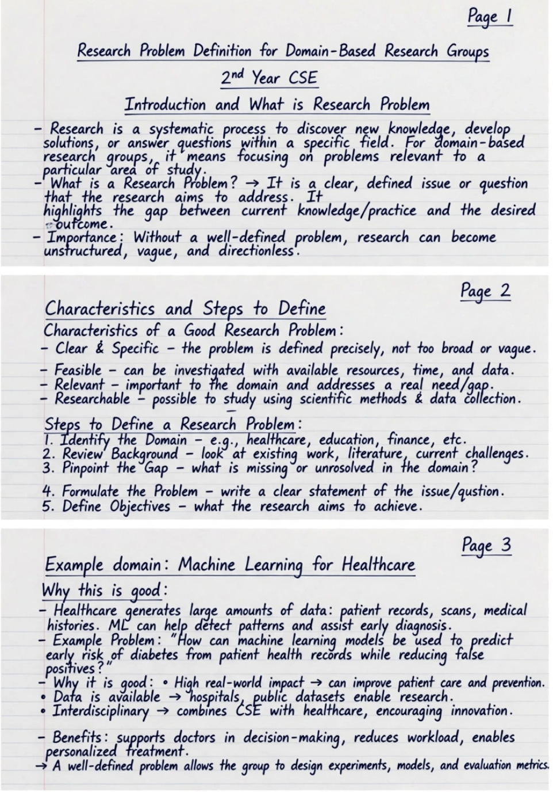

## Identification of Interdisciplinary Areas

### 1. Meaning

**Interdisciplinary research** is research that combines **knowledge, theories, methods, and techniques from two or more academic disciplines** to study a problem that cannot be adequately solved from a single discipline.

In simple words:

> **Interdisciplinary research = Combining different subjects to solve one common problem.**

For example, developing a **healthcare AI system** may require:

* **Computer Science** → AI/ML algorithms
* **Medicine** → disease knowledge
* **Statistics** → data analysis
* **Psychology** → understanding patient behaviour

---

### 2. What is an Interdisciplinary Area?

An **interdisciplinary area** is a research field where concepts from multiple disciplines overlap and work together.

For example:

| Research Problem           | Disciplines Involved                                               |
| -------------------------- | ------------------------------------------------------------------ |
| AI-based disease diagnosis | Computer Science + Medicine + Statistics                           |
| Smart city development     | Civil Engineering + IoT + Computer Science + Environmental Science |
| Climate change prediction  | Environmental Science + Mathematics + Computer Science             |
| Cybersecurity in banking   | Computer Science + Finance + Law                                   |
| Educational technology     | Education + Psychology + Computer Science                          |
| Autonomous vehicles        | Mechanical Engineering + Electronics + AI + Computer Science       |

---

## 3. Identification of Interdisciplinary Areas

**Identification of interdisciplinary areas** means finding research problems where the  **knowledge or methods of multiple disciplines are required** .

A researcher can identify such areas through the following steps:

### Step 1: Identify the Research Problem

Clearly define the problem that needs to be investigated.

**Example:**
How can we detect heart disease automatically from ECG signals?

### Step 2: Identify the Knowledge Required

Ask:

> "What different types of knowledge are needed to understand and solve this problem?"

For ECG-based disease detection:

* Medical knowledge → understanding ECG and cardiac diseases
* Signal processing → processing ECG signals
* AI/ML → disease classification
* Statistics → evaluating results

### Step 3: Identify Overlapping Disciplines

Find subjects whose concepts, methods, or techniques can contribute to the problem.

**Computer Science + Medicine + Signal Processing + Statistics**

### Step 4: Examine Existing Research

Study research papers, theses, reports, and existing projects to determine:

* Which disciplines are already being used?
* What methods are being combined?
* What gaps remain?
* Can another discipline contribute?

### Step 5: Identify the Common Research Objective

The disciplines should work toward a  **common research question** , rather than simply being placed together.

### Step 6: Define the Interdisciplinary Research Area

After identifying the connections, formulate a specific interdisciplinary research area.

**Example:**

> **"Deep Learning-based Automated Diagnosis of Cardiac Diseases using 12-Lead ECG Signals."**

Here, the research connects  **Medicine, Signal Processing, Machine Learning, and Statistics** .

---

## 4. Sources for Identifying Interdisciplinary Areas

A researcher can identify interdisciplinary opportunities through:

1. **Literature review** – finding connections between different research fields.
2. **Research gaps** – identifying problems that existing disciplines have not completely solved.
3. **Emerging technologies** – AI, IoT, blockchain, biotechnology, robotics, etc.
4. **Real-world problems** – practical problems often require multiple disciplines.
5. **Industry requirements** – industry problems frequently combine technical and domain-specific knowledge.
6. **Conferences and workshops** – interdisciplinary research is often discussed in emerging research forums.
7. **Collaboration with experts** – discussions with researchers from different fields can reveal new research possibilities.

---

## 5. Example

### Problem:

**Predicting student academic performance**

Possible disciplines:

**Education**
↓
Student learning and assessment

**Psychology**
↓
Motivation, behaviour and learning patterns

**Computer Science**
↓
Machine learning and predictive models

**Statistics**
↓
Data analysis and validation

Therefore:

> **Education + Psychology + Computer Science + Statistics → Educational Data Mining / Learning Analytics**

This is an  **interdisciplinary research area** .

---

### 6. Why Identify Interdisciplinary Areas?

It helps researchers:

* Solve **complex real-world problems**
* Bring different perspectives to a problem
* Develop **innovative solutions**
* Combine complementary research methods
* Discover new research questions
* Improve practical applicability of research
* Create opportunities for collaboration

### Exam-ready definition

> **Identification of interdisciplinary areas is the process of recognizing research problems that require the integration of knowledge, methods, theories, or techniques from two or more academic disciplines to achieve a common research objective.**

**Easy way to remember:**

Sure. For a  **3-page handwritten A4 assignment** , the content should look like something a student would naturally write—not like a highly polished textbook. I’d suggest roughly  **900–1100 words** , with headings, simple explanations, and a few examples/diagrams that are easy to reproduce by hand.

# Identification of Interdisciplinary Areas

## Introduction

Research is a systematic process of finding answers to questions or solving problems. In the present time, many problems are becoming more complex and cannot be solved by using the knowledge of only one subject. Such problems require knowledge and methods from different subjects. This gives rise to the concept of  **interdisciplinary research** .

For example, developing a system for detecting heart disease using Artificial Intelligence requires knowledge of Computer Science, Medicine, Statistics and Signal Processing. Therefore, different disciplines work together to solve one common problem.

Thus, identification of interdisciplinary areas is an important step in modern research.

## Meaning of Interdisciplinary Research

The word **interdisciplinary** means involving more than one academic discipline. Interdisciplinary research combines the knowledge, theories, methods and techniques of two or more subjects to study a common research problem.

In simple words:

**Interdisciplinary Research = Different subjects + Common problem + Combined approach**

For example, consider the problem of predicting climate change. Environmental Science provides knowledge about climate and pollution, Mathematics provides mathematical models, Statistics helps in analysing data, and Computer Science provides Artificial Intelligence and Machine Learning techniques.

Therefore, interdisciplinary research provides a broader approach to solving complex problems.

## Identification of Interdisciplinary Areas

Identification of interdisciplinary areas means finding those research problems where the knowledge of more than one discipline is required.

A researcher should first understand the research problem and then identify the different types of knowledge required to solve it.

The following steps can be used for identifying interdisciplinary research areas.

### 1. Identification of the Research Problem

The first step is to clearly identify the problem that needs to be studied.

For example:

**Problem:** How can heart diseases be detected automatically using ECG signals?

This problem cannot be completely solved by Computer Science alone because medical knowledge is also required.

### 2. Identification of Required Knowledge

After identifying the problem, the researcher should determine what knowledge is needed.

For ECG-based disease detection:

* Medicine → knowledge of heart diseases and ECG
* Signal Processing → processing ECG signals
* Computer Science → development of AI/ML models
* Statistics → analysis and evaluation of results

Thus, several areas of knowledge are required.

### 3. Identification of Related Disciplines

The researcher then identifies the academic disciplines that can contribute to solving the problem.

For example:

**Medicine + Computer Science + Signal Processing + Statistics**

These disciplines can work together to develop an effective solution.

### 4. Study of Existing Research

The researcher should study previously published research papers, books, reports and other sources.

A literature review helps the researcher to understand:

* What work has already been done?
* Which disciplines have been used?
* What methods have been applied?
* What limitations exist?
* What research gaps are present?

Research gaps often provide opportunities for interdisciplinary research.

### 5. Finding the Common Objective

Different disciplines should not simply be combined without a purpose. They should contribute towards a  **common research objective** .

For example, in healthcare AI, doctors provide medical knowledge while computer scientists develop the AI model. Both work towards the common objective of improving disease diagnosis.

### 6. Formulation of the Interdisciplinary Research Area

After identifying the required disciplines and their contribution, the researcher can formulate a specific interdisciplinary research area.

For example:

**"Deep Learning Based Automated Diagnosis of Cardiac Diseases using 12-Lead ECG Signals."**

This research area combines Medicine, Computer Science, Machine Learning, Signal Processing and Statistics.

## Examples of Interdisciplinary Areas

Some common interdisciplinary research areas are given below:

| Research Problem           | Disciplines Involved                                   |
| -------------------------- | ------------------------------------------------------ |
| AI-based disease diagnosis | Computer Science + Medicine + Statistics               |
| Smart city development     | Civil Engineering + IoT + Computer Science             |
| Climate change prediction  | Environmental Science + Mathematics + Computer Science |
| Cybersecurity in banking   | Computer Science + Finance + Law                       |
| Educational technology     | Education + Psychology + Computer Science              |
| Autonomous vehicles        | Mechanical Engineering + Electronics + AI              |

These examples show that real-world problems often require contributions from different fields.

## Sources for Identifying Interdisciplinary Areas

A researcher can identify interdisciplinary areas through several sources:

1. **Literature Review:** Studying research papers helps identify connections between different fields.
2. **Research Gaps:** Limitations in existing research may require knowledge from another discipline.
3. **Emerging Technologies:** Technologies such as AI, IoT, Robotics and Biotechnology create new interdisciplinary research opportunities.
4. **Real-World Problems:** Problems related to healthcare, environment, education and transportation often require multiple disciplines.
5. **Industry Requirements:** Industrial problems generally involve technical as well as domain-specific knowledge.
6. **Interaction with Experts:** Discussions with researchers and experts from different fields can help identify new research opportunities.

## Importance of Interdisciplinary Research

Interdisciplinary research is important because it provides a broader perspective of a problem. Its major benefits are:

* It helps solve  **complex problems** .
* It combines knowledge from different subjects.
* It encourages  **innovation and creativity** .
* It provides better and more practical solutions.
* It promotes collaboration between researchers.
* It helps identify new research questions.
* It increases the practical usefulness of research.

For example, a smart healthcare system can become more useful when doctors, computer scientists, statisticians and engineers work together.

## Simple Framework

The process of identifying an interdisciplinary area can be represented as:

**Research Problem**
↓
**Identify Required Knowledge**
↓
**Identify Related Disciplines**
↓
**Study Existing Research**
↓
**Find Research Gap**
↓
**Define Common Objective**
↓
**Formulate Interdisciplinary Research Area**

## Conclusion

Identification of interdisciplinary areas is an important part of modern research. Many present-day problems are complex and cannot be solved effectively using the knowledge of a single discipline. Interdisciplinary research brings together different subjects and allows researchers to use their combined knowledge and methods.

A researcher can identify an interdisciplinary area by understanding the research problem, identifying the required knowledge, studying existing literature, finding research gaps and connecting relevant disciplines with a common objective.

Therefore, interdisciplinary research plays an important role in developing  **innovative, practical and effective solutions to complex real-world problems** .

**For handwriting:** keep the main headings underlined, draw the table with a ruler, and make the final flowchart in the middle of the page. With normal student handwriting and spacing, this should comfortably spread across  **3 A4 sheets** .

**Problem → Required knowledge → Different disciplines → Common objective → Interdisciplinary research area.**

Here is the landscape version with plain background:

