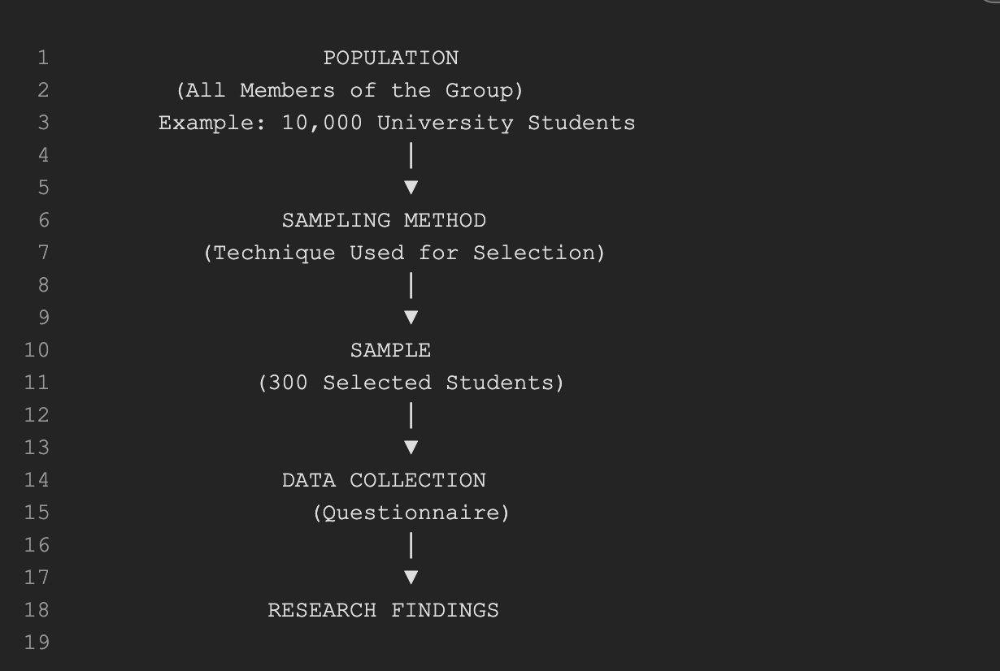
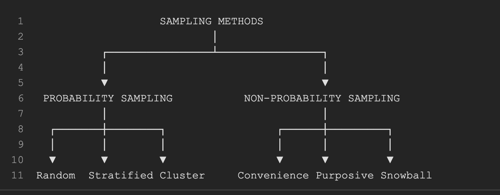

For a  **10-mark answer** , adding a simple and neat diagram can help you score better and make your answer look more organized.

# Sampling Methods

## Introduction

Sampling is the process of selecting a small group of individuals from a larger population for research purposes. The technique used to select the sample is known as a  **sampling method** .

## Definition

**Sampling Method** refers to the procedure used by a researcher to select a subset of individuals from a population to collect data and draw conclusions about the entire population.

---

## Neat Diagram

---

## Concept of Sampling

In research, studying the entire population is often difficult because it requires substantial time, money, and effort. Therefore, researchers select a representative sample from the population. The way this sample is selected is called a sampling method.

### Example

Suppose a researcher wants to study the impact of social media on students' academic performance.

* Population = 10,000 students
* Sample = 300 students
* Sampling Method = Procedure used to choose the 300 students

---

## Importance of Sampling

1. Saves time.
2. Reduces research cost.
3. Makes data collection manageable.
4. Provides quicker results.
5. Helps study large populations effectively.

---

## Types of Sampling Methods

### 1. Probability Sampling

Every member of the population has a known chance of being selected.

Examples:

* Simple Random Sampling
* Stratified Sampling
* Systematic Sampling
* Cluster Sampling

**Example:** Selecting students through a lottery system.

### 2. Non-Probability Sampling

Members are selected based on convenience, judgment, or availability.

Examples:

* Convenience Sampling
* Purposive Sampling
* Quota Sampling
* Snowball Sampling

**Example:** Surveying students who are readily available in the library.

---

## Classification Diagram

---

## Conclusion

Sampling methods are essential in research because they allow researchers to collect information from a representative group rather than the entire population. Proper sampling improves the accuracy, reliability, and efficiency of research findings.

### Exam Writing Tip

Use the format:

**Definition → Diagram → Concept → Example → Importance → Types → Conclusion**

This structure can easily fetch **9-10 marks** in Research Methodology examinations.
