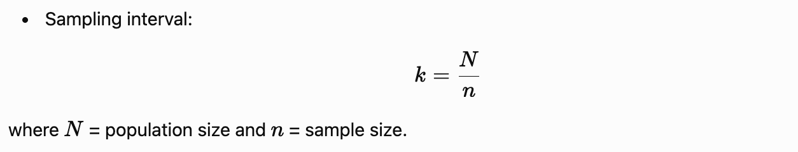

# Techniques of Sampling

Sampling is the process of selecting a subset of individuals or items from a population to study and draw conclusions about the entire population.

Sampling techniques are broadly classified into **Probability Sampling** and  **Non-Probability Sampling** .

## 1. Probability Sampling Techniques

In probability sampling, every member of the population has a known and non-zero chance of being selected.

### a) Simple Random Sampling

* Every element has an equal chance of selection.
* Selection is done using random numbers, lottery methods, or computer-generated randomization.
* **Example:** Selecting 50 students from 500 students using a lottery.

**Advantages:** Unbiased, easy to understand.
**Disadvantages:** Requires a complete list of the population.

### b) Systematic Sampling

* Every *kth* element is selected after choosing a random starting point.
* Sampling interval:

**Example:** Selecting every 10th customer entering a store.

### c) Stratified Sampling

* Population is divided into homogeneous groups (strata).
* Samples are randomly selected from each stratum.

**Example:** Selecting students from each academic year (1st, 2nd, 3rd, and 4th year).

**Advantage:** Ensures representation of all groups.

### d) Cluster Sampling

* Population is divided into clusters.
* Entire clusters are randomly selected.

**Example:** Selecting 5 schools from a district and surveying all students in those schools.

### e) Multistage Sampling

* Sampling is conducted in multiple stages using different methods.

**Example:** State → District → School → Student selection.

---

## 2. Non-Probability Sampling Techniques

In non-probability sampling, the probability of selection is unknown.

### a) Convenience Sampling

* Participants are selected based on ease of access.

**Example:** Surveying students available in a classroom.

**Advantage:** Quick and inexpensive.
**Disadvantage:** High risk of bias.

### b) Purposive (Judgmental) Sampling

* Researcher selects participants based on specific characteristics or expertise.

**Example:** Interviewing AI researchers about Generative AI.

### c) Quota Sampling

* Population is divided into categories, and a fixed number of participants are selected from each category.

**Example:** Selecting 50 males and 50 females for a survey.

### d) Snowball Sampling

* Existing participants recruit new participants.
* Useful for hard-to-reach populations.

**Example:** Studying rare disease patients through referrals.

---

## Comparison: Probability vs Non-Probability Sampling

| Feature             | Probability Sampling        | Non-Probability Sampling         |
| ------------------- | --------------------------- | -------------------------------- |
| Selection Method    | Random                      | Non-random                       |
| Chance of Selection | Known                       | Unknown                          |
| Bias                | Lower                       | Higher                           |
| Generalization      | Strong                      | Limited                          |
| Cost                | Higher                      | Lower                            |
| Examples            | Random, Stratified, Cluster | Convenience, Purposive, Snowball |

## Conclusion

Sampling techniques help researchers collect data efficiently without studying the entire population. **Probability sampling** provides more representative and statistically reliable results, whereas **non-probability sampling** is useful when time, cost, or accessibility constraints exist. For scientific research, probability sampling methods are generally preferred.
