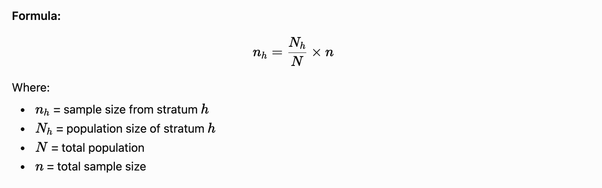

# Simple Random Sampling (SRS)

## Definition

**Simple Random Sampling** is a probability sampling technique in which every member of the population has an **equal and independent chance** of being selected for the sample.

In other words, each possible sample of a given size has the same probability of being chosen.

---

## Meaning

Suppose a college has  **500 students** , and a researcher wants to survey  **50 students** . In Simple Random Sampling, every student has an equal opportunity to be selected, regardless of age, gender, branch, or academic performance.

---

## Methods of Selection

### 1. Lottery Method

* Write the names or numbers of all population members on slips.
* Mix them thoroughly.
* Randomly draw the required number of slips.

**Example:** Selecting 10 students from a class of 60 using a lottery.

### 2. Random Number Method

* Assign a number to each population member.
* Use random number tables or computer software to generate random numbers.
* Select the corresponding members.

**Example:** Using Excel's `RAND()` function to select participants.

---

## Steps in Simple Random Sampling

1. Define the target population.
2. Prepare a complete list of all population members (sampling frame).
3. Assign a unique number to each member.
4. Choose a random selection method.
5. Select the required sample size.
6. Collect data from the selected participants.

---

## Example

A researcher wants to study the study habits of students in a university having  **1000 students** .

* Population (N) = 1000 students
* Required Sample (n) = 100 students
* Each student is assigned a number from 1 to 1000.
* A computer randomly selects 100 numbers.
* The corresponding students form the sample.

---

## Advantages

* Eliminates researcher bias.
* Easy to understand and implement.
* Every member gets an equal chance of selection.
* Suitable for statistical analysis.
* Results are generally representative of the population.

---

## Disadvantages

* Requires a complete list of the population.
* Can be time-consuming for large populations.
* May be costly when population members are geographically dispersed.
* Selected sample may not always represent all subgroups proportionally.

---

## Applications

* Educational research
* Social science surveys
* Market research
* Medical and health studies
* Opinion polls

---

## Conclusion

**Simple Random Sampling** is the most basic and widely used probability sampling technique. It ensures fairness by giving every population member an equal chance of selection, thereby reducing bias and increasing the reliability of research findings.

===========================================

## b) Systematic Sampling

### Definition

**Systematic Sampling** is a probability sampling technique in which researchers select every **kth element** from a population after choosing a random starting point.

The sampling interval ( **k** ) is calculated as:

k=Nnk = \frac{N}{n}Where:

* **N** = Total population size
* **n** = Required sample size
* **k** = Sampling interval

---

### Procedure

1. Determine the population size ( **N** ).
2. Decide the sample size ( **n** ).
3. Calculate the sampling interval ( **k = N/n** ).
4. Randomly select a starting point between 1 and  **k** .
5. Select every **kth** element thereafter until the desired sample size is reached.

---

### Example

Suppose a college has **1,000 students** and a researcher wants a sample of  **100 students** .

k=1000100=10k = \frac{1000}{100} = 10If the randomly chosen starting number is  **4** , the selected students will be:

**4, 14, 24, 34, 44, ... , 994**

Thus, every **10th student** is included in the sample.

---

### Advantages

* Simple and easy to implement.
* Faster than simple random sampling.
* Ensures samples are spread across the entire population.
* Suitable for large populations.

---

### Disadvantages

* Can produce biased results if the population has a hidden pattern.
* Requires a complete ordered list of the population.
* Less random than simple random sampling.

---

### Applications

* Quality control in manufacturing.
* Customer satisfaction surveys.
* Educational and social science research.
* Population and household surveys.

### One-Line Exam Definition

**Systematic sampling is a probability sampling method in which every kth member of a population is selected after a random starting point is chosen.**

======================

# Stratified Sampling

## Definition

**Stratified Sampling** is a probability sampling technique in which the population is divided into  **homogeneous subgroups called strata** , and samples are randomly selected from each stratum.

The purpose is to ensure that all important groups in the population are adequately represented in the sample.

---

## Example

Suppose a college has  **1,000 students** :

* First Year: 250 students
* Second Year: 300 students
* Third Year: 200 students
* Fourth Year: 250 students

If a researcher wants a sample of  **100 students** , the students can be selected proportionally from each year:

* First Year: 25 students
* Second Year: 30 students
* Third Year: 20 students
* Fourth Year: 25 students

Random selection is then performed within each group.

---

## Steps in Stratified Sampling

1. Define the target population.
2. Divide the population into strata based on a relevant characteristic (e.g., age, gender, department, income level).
3. Determine the sample size required.
4. Decide how many samples to take from each stratum.
5. Select samples randomly from each stratum.
6. Combine all selected samples to form the final sample.

---

## Types of Stratified Sampling

### 1. Proportionate Stratified Sampling

The sample size from each stratum is proportional to its size in the population.

### 2. Disproportionate Stratified Sampling

Different strata are sampled at different rates, regardless of their population size.

**Example:** A researcher may intentionally select equal numbers of males and females even if one group is much larger.

---

## Advantages

1. Ensures representation of all important subgroups.
2. Increases the accuracy and precision of results.
3. Reduces sampling error.
4. Allows comparison among different strata.
5. Useful when the population is heterogeneous.

---

## Disadvantages

1. Requires detailed information about the population.
2. Can be time-consuming and costly.
3. Incorrect stratification may lead to biased results.
4. More complex than simple random sampling.

---

## Applications

* Educational research (students from different years or departments)
* Market research (different age groups)
* Healthcare studies (different patient categories)
* Social science surveys (gender, income, occupation groups)

---

## Exam-Oriented Answer (5 Marks)

**Stratified Sampling** is a probability sampling method in which the population is divided into homogeneous groups called  **strata** , and random samples are selected from each stratum. It ensures that all important groups are represented in the sample. For example, a college survey may select students from each academic year separately. Its main advantages are better representation and higher accuracy, while its disadvantages include complexity and the need for detailed population information.

=========================

# Cluster Sampling

## Definition

**Cluster Sampling** is a probability sampling technique in which the entire population is divided into naturally occurring groups called  **clusters** , and then some clusters are selected randomly for study. Data is collected from all members (or a sample of members) within the selected clusters.

## Key Idea

Instead of selecting individuals directly, the researcher selects **groups (clusters)** and studies the members within those groups.

## Steps in Cluster Sampling

1. Identify the population.
2. Divide the population into clusters.
3. Randomly select one or more clusters.
4. Collect data from all members or a sample of members within the selected clusters.

## Example

Suppose a researcher wants to study the academic performance of school students in a city.

* Population: All students in the city.
* Clusters: Schools in the city.
* Randomly select 10 schools.
* Survey all students (or a sample of students) in those selected schools.

Here, **schools** act as clusters.

## Types of Cluster Sampling

### 1. Single-Stage Cluster Sampling

All members of the selected clusters are included in the study.

**Example:** Select 5 schools randomly and survey every student in those schools.

### 2. Two-Stage Cluster Sampling

After selecting clusters, a sample of individuals is chosen from each selected cluster.

**Example:** Select 5 schools randomly and then select 20 students from each school.

## Advantages

* Economical and cost-effective.
* Saves time and effort.
* Useful when the population is geographically dispersed.
* Does not require a complete list of all individuals.

## Disadvantages

* May be less accurate than simple random sampling.
* Clusters may not perfectly represent the entire population.
* Sampling error can be higher.

## Difference Between Stratified and Cluster Sampling

| Stratified Sampling                                     | Cluster Sampling                                         |
| ------------------------------------------------------- | -------------------------------------------------------- |
| Population is divided into homogeneous strata.          | Population is divided into naturally occurring clusters. |
| Samples are taken from every stratum.                   | Only selected clusters are studied.                      |
| Ensures representation of all groups.                   | Reduces cost and effort.                                 |
| Example: Students grouped by year (1st, 2nd, 3rd, 4th). | Students grouped by schools.                             |

## Exam-Oriented Definition (2–3 Marks)

**Cluster Sampling is a probability sampling technique in which the population is divided into clusters, and a random sample of clusters is selected for data collection. It is commonly used when the population is large and geographically scattered.**
